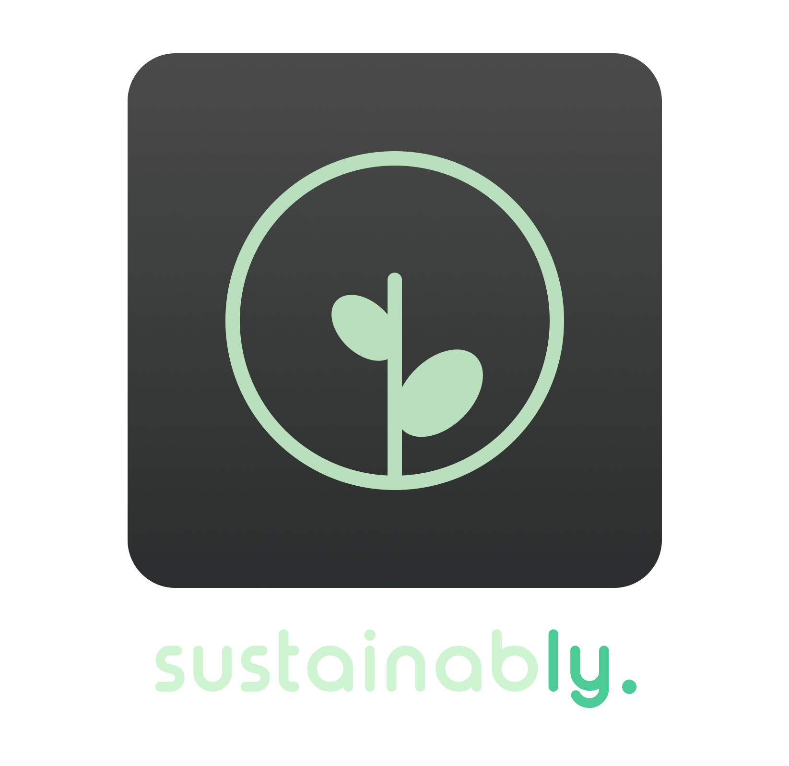
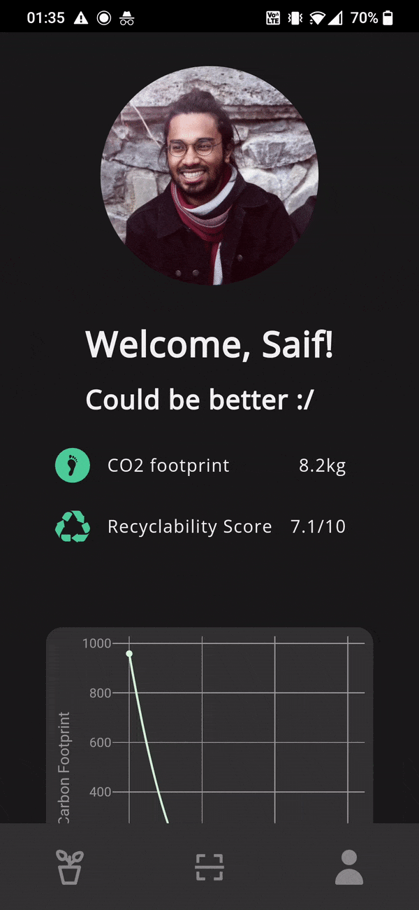
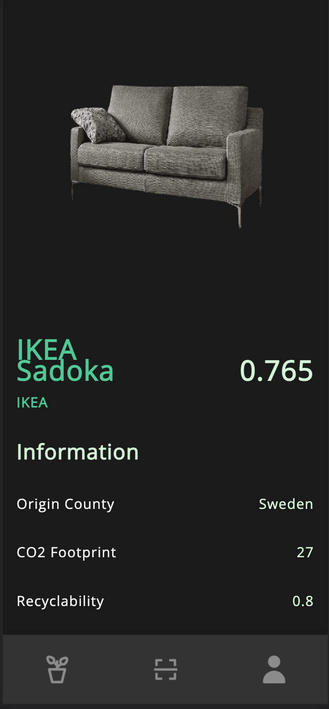

<p align="center">

</p>

# sustainably

**sustainably** is a web-app built on modern technologies that aims to make sustainable and environmentally conscious living easy. Everyone wants to do and be good. Being good feels good. But sometimes it just takes so much time. **sustainably** leverages computer-vision machine learning for giving you concise information related to a product's carboon footprint, recyclability, country of origin, and other useful information such as heavily impactful activities related to the product.

<p align="center">
     
</p>

## Running 

Front-end

```shell
# install dependencies
bundle install

# run client
bundle exec jekyll serve --livereload
```

Back-end
```
#install requirements
pip install -r backend-service/requirements.txt

# run
gunicorn
```
